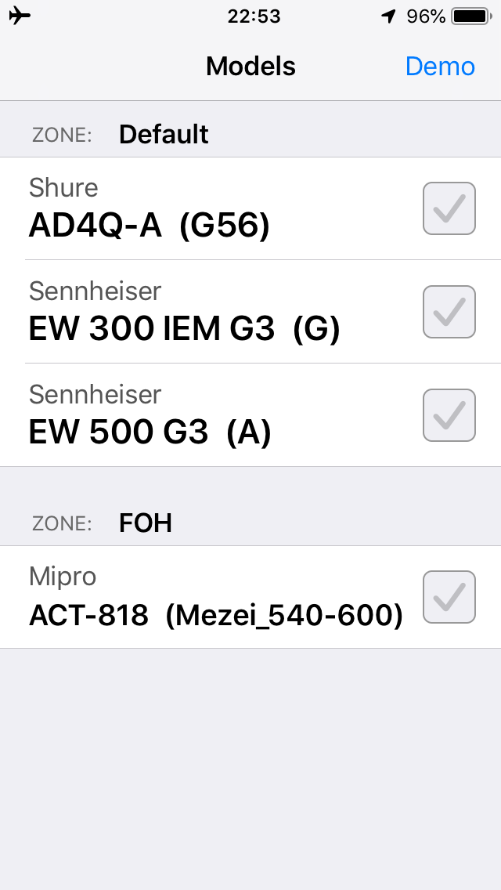
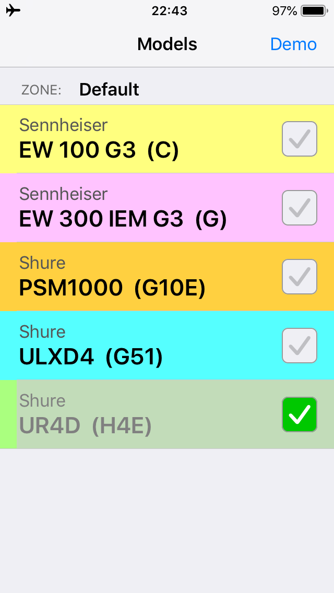
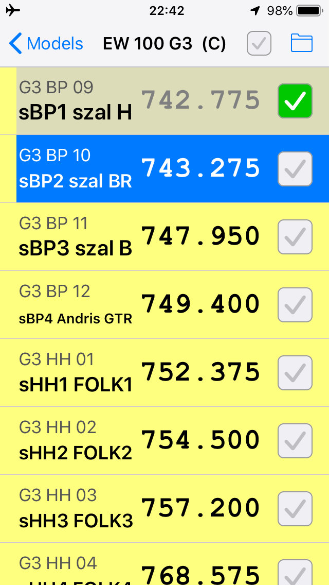
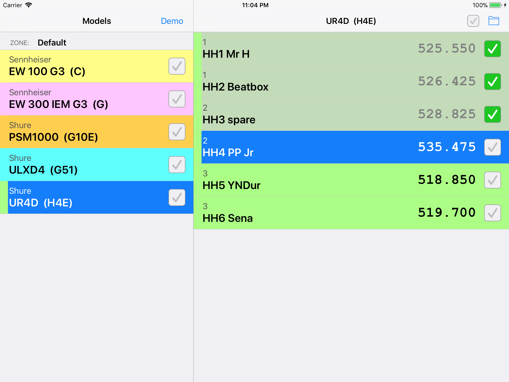
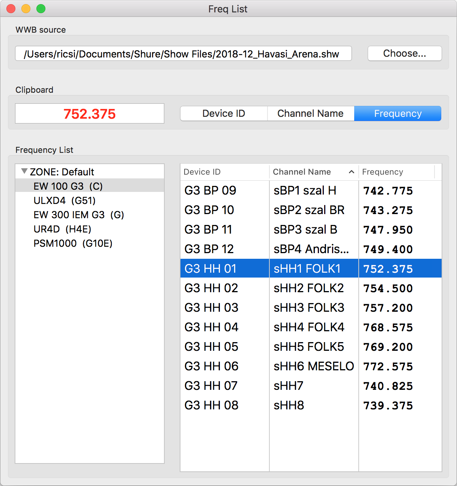

# FreqList
iOS / macOS app for RF coordinators

FreqList is a utility app for wireless system (RF) coordinators, that displays coordination data in a structured manner. 
The app (currently) reads [Shure Wireless Workbench](http://www.shure.com/americas/products/software/wireless-workbench) files (show, inventory or report), and displays channel data for each zone and model.
  

## FreqList for iOS
The iOS version provides a solution in the scenario where you coordinate on a computer, but some (or all) of the devices are not controlled directly, and have to be tuned manually.
You share the coordination file (via AirDrop, email or any other way), and FreqList provides checklists for each model, making the tuning of devices easier, faster and less error prone.
  

  
  

### Features
- opens known file formats via AirDrop, email or any other app
- structured checklists of channels
- displays WWB defined channel colors
- easy to read display of frequency
- auto-advances selection on checking selected channel
- check/uncheck all button to quickly ignore controlled or unimportant models

### Requirements
- Xcode 10.2.1+ to build
- iPhone or iPad running iOS 11.2+
  

## FreqList for Mac
The macOS version is intended mainly to interact between Shure WWB and Sennheiser WSM. When you coordinate in WWB, but have WSM controlled Sennheiser devices too, transfering data from WWB to WSM is not so simple. The frequency of a WWB channel can't be copy/pasted directly into a WSM channel, because formats are different. 

You can open the WWB coordination file FreqList, which provides a structured list of channels, as in WWB, but from here you can readily copy/paste frequencies or channel names into WSM.
  

### Features
- structured lists of channels
- auto-copy of selected frequency or channel name
- fast keyboard navigation
  - TAB changes between models and channel lists
  - UP/DOWN arrows change channels
  - LEFT/RIGHT arrows change selected (copied) text

### Requirements
- Xcode 10.2.1+ to build
- macOS 10.11+ to run
  

## Supported file formats
- Shure Wireless Workbench 6
  - Show file (.SHW)
  - Inventory (.INV)
  - Report (.CSV)
 - FreqList Project file (.FLXML)
